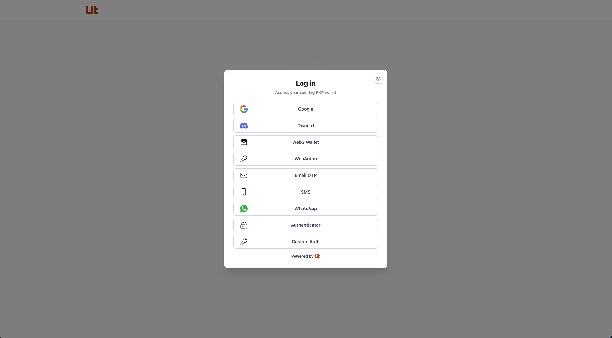
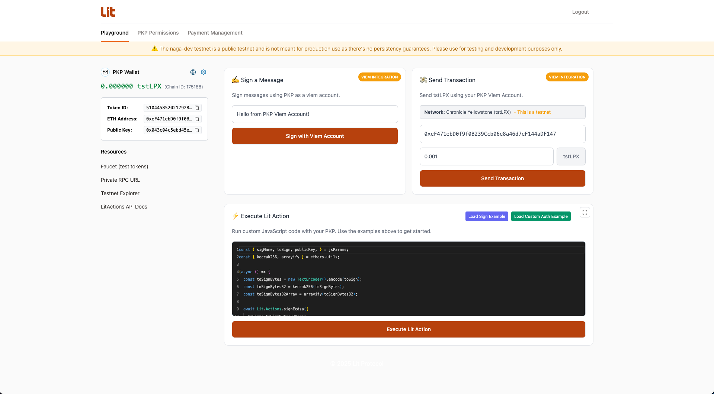

# Lit Explorer Naga

Lit Explorer Naga is an application that allows you to authenticate with Lit Protocol using the native Lit auth methods.

## FAQs

### What "logged-in" means here

- You are considered "logged-in" when both a PKP and an auth context exist in state.

### How you become "logged-in"

After authenticating with a method (Google, Discord, WebAuthn, EOA, Stytch, Custom), either:

- You select an existing PKP in the PKP selection section
- You mint a new PKP and immediately create `authContext`, then set `user`

### What redirect happens and when

The `<LitAuthProvider />` does not redirect on successful login. It simply closes the modal once user is set and isAuthenticated becomes true.

The dashboard is always the index route for `/`, and it conditionally renders based on auth state from context. When the user logs in, React re-renders the same component with different UI.

Inside `LoggedInDashboard`, it reads user from `useLitAuth()`. If there’s no user, it shows a sign-in experience and, in popup mode, auto-opens the modal.

# Screenshots

## Login Modal

## Logged in Dashboard
